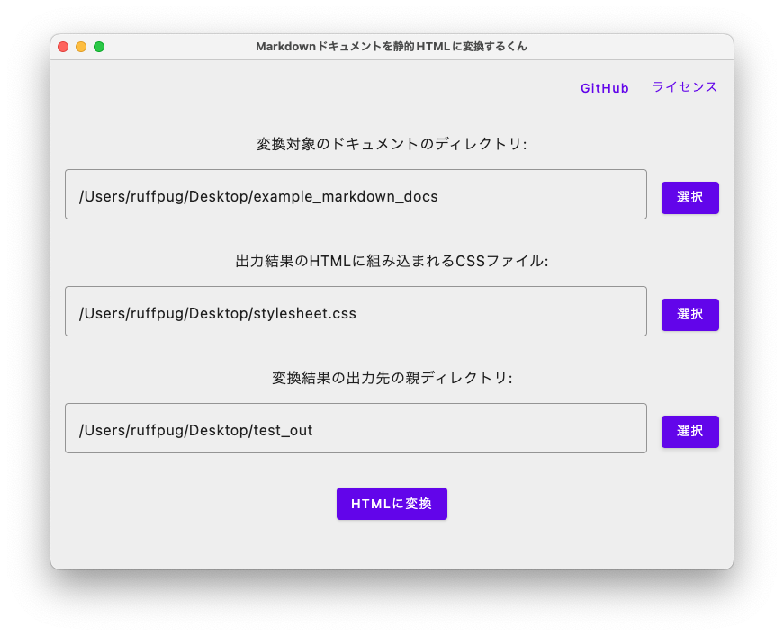

# Markdownドキュメントを静的HTMLに変換するくん

https://github.com/ruffpug/MarkdownStaticHtmlKun  
[](https://github.com/ruffpug/MarkdownStaticHtmlKun/actions/workflows/CI.yml)  

  

## なにこれ?

Markdownで書かれたドキュメントをHTMLファイルに変換するツールです。  
ツールで変換を掛けた段階でHTMLファイルが出来上がるので、特に別途Webサーバを立てる必要もなく、HTMLファイルをブラウザで開けばすぐに閲覧できる状態になります。  

## スタイルシートについて

本アプリを利用するためには1点準備が必要です。  

本ツールで出力を行う際に必要となるスタイルシートのCSSファイルをご用意ください。  
本アプリを起動すると、CSSファイルの選択が要求されますが、ここで指定したCSSファイルの中身が、出力されるHTMLファイルの `<style>` タグに出力されます。  
任意のスタイルシートを読み込ませることによって、出力されるHTMLドキュメントの見た目を変更することができます。  

ヒント:  
[こちら](https://github.com/sindresorhus/github-markdown-css) のリポジトリで公開されているCSSファイルは非常に素晴らしいものです。  
このCSSファイルを読み込ませると、どうやらうまく動作するみたいです。  

(必要に応じて、以下のような余白の設定を末尾に付け加えても良いかもです。)  

```css
.markdown-body {
  box-sizing: border-box;
  min-width: 200px;
  max-width: 980px;
  margin: 0 auto;
  padding: 45px;
}

@media (max-width: 767px) {
  .markdown-body {
    padding: 15px;
  }
}
```

## 出力されるHTMLファイルの仕様

本アプリによって出力されるHTMLファイルは以下のような仕様となります。

```html
<html>
 <head>
  <!-- ↓ のようなViewportの設定がされています。 -->
  <meta name="viewport" content="width=device-width, initial-scale=1">
  
  <style> /* ここに選択されたCSSファイルの内容が出力されます。 */ </style>
 </head>
 
 <!-- bodyタグには「markdown-body」というクラス名が設定されます。 -->
 <body class="markdown-body">
   <!-- ここに変換元のMarkdownファイルをHTMLに変換した内容が出力されます。 -->
 </body>
</html>
```

* Viewportの設定を行うmetaタグが出力されます。
* 選択されたCSSファイルの中身がstyleタグにて出力されます。
* bodyタグには `markdown-body` クラス名が付与されており、その直下にMarkdownをHTMLに変換した内容が出力されます。
* Markdownのリンク構文において、同一ドキュメントの別Markdownファイルへのリンクの拡張子は自動的にHTMLに読み替えられます。
  * 例: Markdown中に `[別MDファイルへのリンク](Hoge.md)` というリンク構文がある場合
  * 出力されるHTMLでは `<a href="Hoge.html">別MDファイルへのリンク</a>` というaタグに置き換えられて出力されます。

## アプリの操作説明

本アプリを起動すると以下の3項目の入力が促されます。  

* 変換対象のドキュメントのディレクトリ
  * 変換を行いたいMarkdownドキュメントが配置されているディレクトリのパスです。
  * ここで指定したディレクトリ以下が (子ディレクトリも含めて) 変換対象として扱われます。
* 出力結果のHTMLに組み込まれるCSSファイル
  * 出力されるHTMLファイルのstyleタグに組み込まれるスタイルシートのCSSファイルです。
* 変換結果の出力先の親ディレクトリ
  * 変換結果を出力する際の「親」ディレクトリです。
  * ここで指定したディレクトリの直下に「docs_〇〇」というディレクトリと「docs_〇〇.txt」というテキストファイルが作られます。
  * 前者が変換後のドキュメントが格納されているディレクトリです。
  * 後者は変換処理が施されたMarkdownの一覧を報告するレポートファイルです。

上記3項目の入力に問題がない場合は「変換」ボタンが活性となります。  
「変換ボタン」を押下することで、変換処理が実行され、その結果がダイアログにて報告されます。  

## コマンド (開発者向け)

* ビルド
  * `./gradlew assemble`
* テスト
  * `./gradlew allTests`
* Lint
  * `./gradlew ktlintCheck`
* デスクトップアプリ実行
  * `./gradlew run`
* 実行可能ファイル出力
  * `./gradlew package`
* ライセンス一覧JSONファイル生成
  * `./gradlew :composeApp:exportLibraryDefinitions -PaboutLibraries.exportPath=src/commonMain/resources`

## ライセンス一覧について

本アプリのライセンス画面には ↓ こちらのライブラリを利用しています。  
https://github.com/mikepenz/AboutLibraries  

> ライセンス一覧JSONファイル生成

のコマンドを実行すると `composeApp/src/commonMain/resources/aboutlibraries.json` が自動生成され、それがアプリ内のライセンスダイアログでも表示されます。  

NOTE: 1点注意点があります。  
既知の問題として、一部のライブラリのライブラリ名が `${project.artifactId}` という名称で表示されることがあります。  
これは、ライブラリ側の設定の問題らしく、暫定的に対処するには、手動で `aboutlibraries.json` の該当箇所を編集する必要があります。  
参考: https://github.com/mikepenz/AboutLibraries/issues/998  
